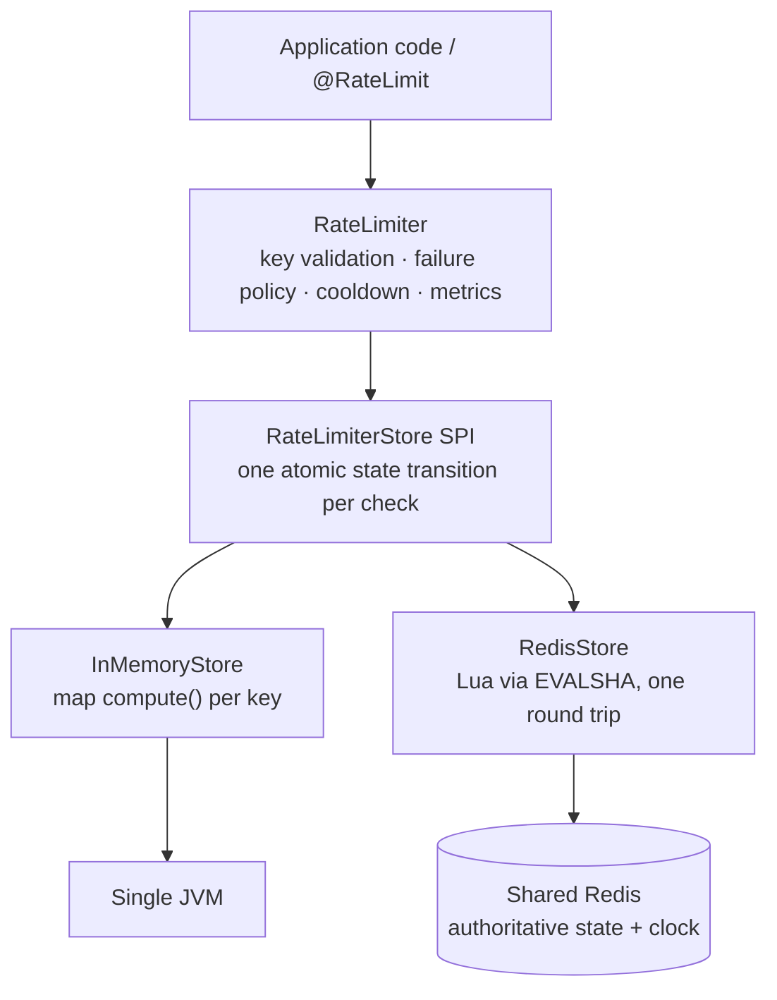
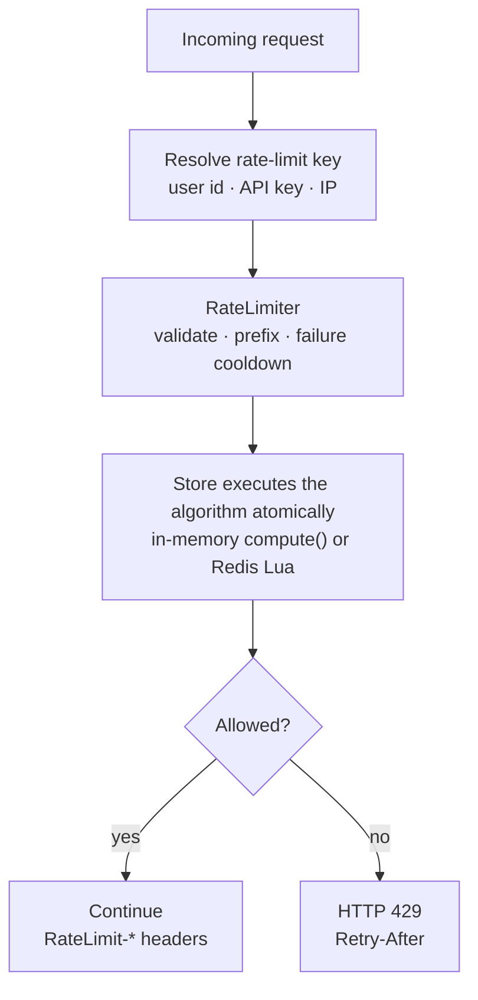
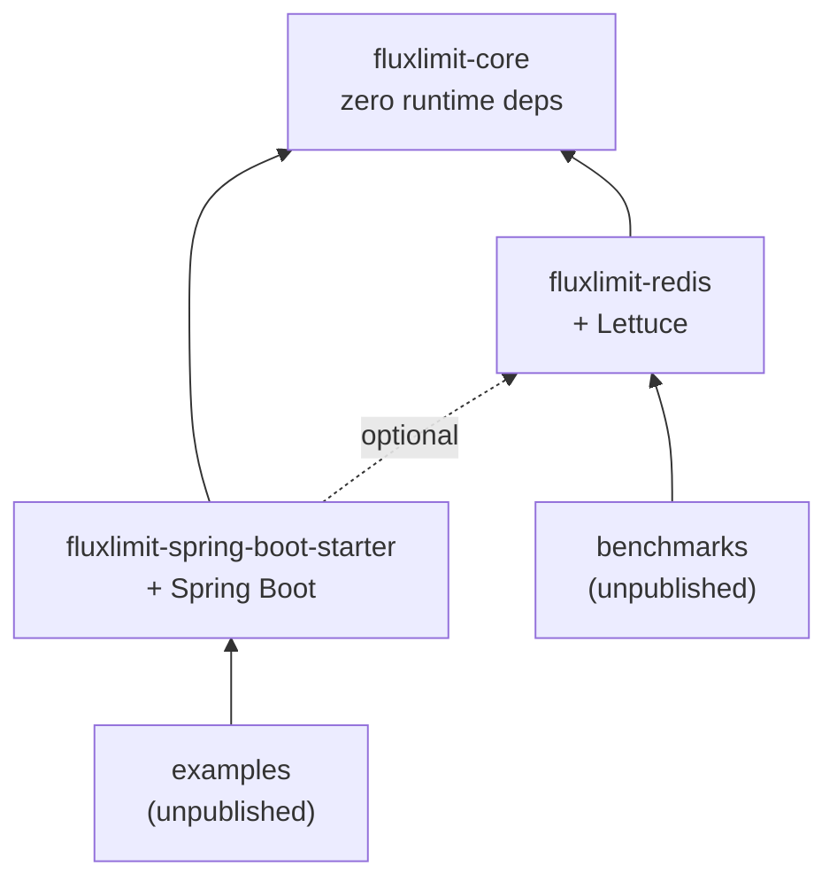

# FluxLimit

**Distributed API rate limiting for Java 21 — the same five-line API from a single JVM to a Redis-backed fleet.**

[](https://central.sonatype.com/artifact/io.github.mithunveluru/fluxlimit-core)
[](https://github.com/mithunveluru/fluxlimit/actions/workflows/build.yml)
[](LICENSE)


> **Status: pre-release (0.x).** Published to Maven Central; the API may still move before 1.0.

## Why FluxLimit

Rate limiting looks trivial until the second server. One JVM can count requests in a map;
a fleet needs *one* shared decision per request — atomic, fast, and correct while servers
disagree about the time. Most Java options give you one half: embedded libraries don't share
state, and wiring Redis yourself means Lua, clock skew, and failure semantics become your
problem.

FluxLimit's position: **the algorithm executes inside the store.** In memory that's one
atomic map operation; on Redis it's one Lua script in one round trip, timestamped by the
*Redis server clock* — no read-modify-write race, no clock-skew handling anywhere. Swapping
single-JVM for distributed is one builder line, with identical semantics.

| Library | Keyed per-client limits | Fleet-shared state | Position |
|---|---|---|---|
| **FluxLimit** | Yes | Yes — Redis, one atomic round trip | Per-key limits shared across a fleet |
| [Bucket4j](https://github.com/bucket4j/bucket4j) | Yes | Yes — many backends | Mature, token bucket only — pick it when you need a backend FluxLimit doesn't have |
| [Resilience4j RateLimiter](https://resilience4j.readme.io) | No | No | Client-side self-throttling for outbound calls |
| Guava `RateLimiter` | No | No | Smooths one hot path in one JVM |

## Features

| Feature | Detail |
|---|---|
| Token Bucket | Controlled bursts, continuous refill, exact integer math — no float drift |
| Sliding Window Counter | Smooth limiting; estimation error is bounded and skews conservative |
| In-memory store | `ConcurrentHashMap`-based, ~4.9M checks/s, self-cleaning |
| Redis store | One atomic Lua round trip per check; standalone, Sentinel, and Cluster |
| Spring Boot starter | `@RateLimit` annotation, SpEL keys, auto-configuration, 429 responses |
| Weighted permits | Expensive endpoints cost more than one permit: `tryAcquire(key, permits)` |
| Failure policy | Fail-open or fail-closed while the store is down — chosen explicitly, flagged `degraded`, never silent |
| Standard headers | `RateLimit-Limit`, `RateLimit-Remaining`, `RateLimit-Reset`, `Retry-After` |
| Micrometer metrics | Requests, store failures, store latency; optional dependency |
| Zero-dependency core | `fluxlimit-core` has no runtime dependencies at all |

## Architecture



- **`RateLimiter` owns no business logic** — it validates, prefixes keys, applies the failure policy, and delegates one atomic state transition to the store.
- **The storage backend is interchangeable** — `RateLimiterStore` is the single SPI; everything distributed-systems-hard lives behind it.
- **The same API at every scale** — in-memory for one JVM, Redis for a fleet, selected with one builder line.
- **No read-then-write anywhere** — each store runs the algorithm inside its native atomicity primitive, so two servers can never double-spend a permit.

## Quick start

Gradle:

```kotlin
implementation("io.github.mithunveluru:fluxlimit-core:0.1.0")
```

Maven:

```xml
<dependency>
  <groupId>io.github.mithunveluru</groupId>
  <artifactId>fluxlimit-core</artifactId>
  <version>0.1.0</version>
</dependency>
```

```java
import io.fluxlimit.RateLimitResult;
import io.fluxlimit.RateLimiter;
import java.time.Duration;

RateLimiter limiter = RateLimiter.builder()
    .tokenBucket(100, Duration.ofMinutes(1))   // or .slidingWindow(100, Duration.ofMinutes(1))
    .build();                                  // in-memory store by default

RateLimitResult result = limiter.tryAcquire("user:" + userId);
if (!result.allowed()) {
    // reject with 429; result.retryAfter() fills the Retry-After header
}
```

That's the whole API. `tryAcquire` never blocks and never throws for a denial — denial is a
result. One limiter instance is shared by all threads, like an HTTP client.

Running the [plain-Java example](examples/plain-java) (`./gradlew :examples:plain-java:run`),
a 5-token bucket refilling over 5 s behaves like this:

```
request  1  allowed  remaining=4  retryAfter=0ms
...
request  5  allowed  remaining=0  retryAfter=0ms
request  6  DENIED   remaining=0  retryAfter=965ms

sleeping 2s...

request  8  allowed  remaining=1  retryAfter=0ms
request  9  allowed  remaining=0  retryAfter=0ms
request 10  DENIED   remaining=0  retryAfter=962ms
```

## Spring Boot

```kotlin
implementation("io.github.mithunveluru:fluxlimit-spring-boot-starter:0.1.0")
```

```java
@RateLimit(key = "#{principal.name}")          // SpEL; default key is the client IP
@GetMapping("/api/search")
SearchResult search(@RequestParam String q) { ... }
```

```properties
fluxlimit.algorithm=token-bucket    # or sliding-window
fluxlimit.limit=100
fluxlimit.period=60s
```

Requests over the limit receive **HTTP 429** before your handler's arguments are even
resolved. Every limited response carries `RateLimit-Limit` and `RateLimit-Remaining`;
a 429 adds `RateLimit-Reset` and `Retry-After` (seconds).

The SpEL template sees `request` (the `HttpServletRequest`) and `principal` — e.g.
`#{request.getHeader('X-Api-Key')}`. An empty key falls back to `request.getRemoteAddr()`;
forwarding headers are never trusted implicitly. Expensive endpoints declare their cost with
`@RateLimit(permits = 5)`.

All properties:

| Property | Default | Meaning |
|---|---|---|
| `fluxlimit.enabled` | `true` | turn the auto-configuration off entirely |
| `fluxlimit.algorithm` | `token-bucket` | `token-bucket` or `sliding-window` |
| `fluxlimit.limit` | `100` | bucket capacity / window limit |
| `fluxlimit.period` | `60s` | refill period / window length |
| `fluxlimit.failure-policy` | `allow` | `allow` or `deny` while the store is down |
| `fluxlimit.key-prefix` | `fluxlimit:` | namespace prepended to every key |
| `fluxlimit.redis.enabled` | `false` | use Redis instead of in-memory |
| `fluxlimit.redis.uri` | — | e.g. `redis://localhost:6379` |
| `fluxlimit.redis.command-timeout` | `50ms` | slower answers count as store failures |

Every auto-configured bean backs off to one you define. If a `MeterRegistry` bean exists,
metrics are bound automatically. A runnable app lives in
[examples/spring-boot](examples/spring-boot), including a k6 load script.

## Redis: going distributed

One in-memory limiter per server means N servers enforce N× your limit. Backing the same
code with Redis gives the whole fleet **one shared budget** — every check is one atomic
Lua execution on one authoritative clock.

```kotlin
implementation("io.github.mithunveluru:fluxlimit-redis:0.1.0")
```

```java
RedisClient client = RedisClient.create("redis://localhost:6379");
StatefulRedisConnection<String, String> connection = client.connect();  // yours: you close it

RateLimiter limiter = RateLimiter.builder()
    .slidingWindow(1000, Duration.ofMinutes(1))
    .store(RedisStore.create(connection))
    .failurePolicy(FailurePolicy.ALLOW)        // the default, stated for clarity
    .build();
```

In Spring Boot it's two properties (`fluxlimit.redis.enabled=true` plus the URI) — the code
doesn't change.

What you get, concretely:

- **One round trip per check** — `EVALSHA`, no retries, no transactions, no locks.
- **No clock skew** — scripts read Redis `TIME`; application server clocks are never consulted.
- **Self-bounding memory** — every key carries a `PEXPIRE` to the moment its state becomes
  indistinguishable from absent; idle keys delete themselves.
- **Survivable failure** — if Redis is unreachable or slower than `commandTimeout` (default
  50 ms), the limiter answers from your `FailurePolicy`, flags the result `degraded()`, and
  re-probes once per second. A dead Redis costs the fleet ~one timeout per second, not 50 ms
  per request. Cluster and Sentinel are supported; see the [ops guide](docs/redis.md).

## How it works

The life of one request:



Everything runs on the caller's thread — no hand-offs, no queues, ~µs in memory, one network
round trip on Redis. If the store fails, the configured `FailurePolicy` answers instead and
the result is flagged `degraded()`; the store is bypassed for a 1 s cooldown before
re-probing, so an outage never adds the timeout to every request.

No background threads touch your request path (the in-memory store sweeps stale keys once
a minute on one daemon thread). Store failures are absorbed, counted, logged once per
episode — and never thrown at you.

## Algorithms

**Token Bucket** — a bucket holds up to `capacity` tokens and refills continuously. Requests
consume tokens; an empty bucket denies. Bursts up to `capacity` are allowed by design.
Counts are stored as scaled integers (micro-tokens), never floats, so a bucket refilling
1 token per 2 s admits exactly one request per 2 s, forever. *Choose it when clients
legitimately burst* — batch jobs, retries, page loads firing several calls.

**Sliding Window Counter** — two counters per key (current and previous window); the previous
window contributes proportionally to its remaining overlap. Estimation error is bounded
(≤ 2× limit only under an adversarial burst pattern, near-exact for steady traffic) and
deliberately rounds toward denying. *Choose it when bursts are unwanted* and "100 per
minute" must never mean 200 in any 60-second span around a window boundary.

Both algorithms exist twice — Java for in-memory, Lua for Redis — with the same semantics.
Derivations and accuracy proofs: [docs/algorithms.md](docs/algorithms.md).

## Modules



Modules exist for exactly one reason: **dependency isolation.** A plain-Java user never
pulls Spring; a non-Redis user never pulls Lettuce; `fluxlimit-core` pulls nothing at all.

| Module | Coordinates | What's inside |
|---|---|---|
| `fluxlimit-core` | `io.github.mithunveluru:fluxlimit-core` | Public API, both algorithms, in-memory store, storage SPI. Zero runtime dependencies |
| `fluxlimit-redis` | `io.github.mithunveluru:fluxlimit-redis` | `RedisStore` and the Lua scripts. Adds Lettuce |
| `fluxlimit-spring-boot-starter` | `io.github.mithunveluru:fluxlimit-spring-boot-starter` | Auto-configuration, `@RateLimit`, servlet interceptor. Adds Spring Boot |
| `benchmarks` | not published | JMH suites, including the Bucket4j/Resilience4j comparison |
| `examples` | not published | Runnable plain-Java and Spring Boot demo apps |

Extending storage means implementing one interface — `RateLimiterStore` — in a new module;
no core changes. The algorithm set is sealed by design: a user-supplied algorithm could not
be executed atomically inside Redis, so the honest extension point is the store, not the
algorithm.

### Project structure

```
fluxlimit/
├── fluxlimit-core/                  # API, algorithms, in-memory store, SPI
├── fluxlimit-redis/                 # RedisStore + Lua scripts
├── fluxlimit-spring-boot-starter/   # auto-configuration, @RateLimit
├── benchmarks/                      # JMH suites (unpublished)
├── examples/
│   ├── plain-java/                  # 40-line framework-free demo
│   └── spring-boot/                 # @RateLimit demo app + k6 load script
└── docs/                            # algorithms math, Redis ops guide, benchmarks
```

## Performance

JMH on JDK 21 (method, caveats, and raw output in [docs/benchmarks.md](docs/benchmarks.md)):

| Scenario | Result |
|---|---|
| In-memory, single thread | ~4.9M checks/s (~0.2 µs/op) |
| In-memory, 8 threads on one hot key | ~3.5M checks/s |
| Contended vs Bucket4j `LocalBucket` | ~4.0M vs ~2.4M ops/s |
| Allocation per check | 192 B, steady state, young-gen only |
| Redis (loopback), p50 / p99 | 0.25 ms / 2.2 ms — one round trip per check |

Single-fork numbers on consumer hardware — treat absolute values as ±30%; the shapes were
stable across runs. Reproduce with `./gradlew :benchmarks:jmh` (add `-PredisBench` with a
local Redis for the Redis suite).

## Testing

`./gradlew build` runs everything (JDK 21; Docker required for the Redis suite):

- **Unit tests** — algorithm math under an injectable fake clock: refill precision, window rotation, boundary conditions, fractional rates.
- **Property-based tests** (jqwik) — invariants over generated schedules: admitted never exceeds capacity plus refill, `remaining` never negative, `retryAfter` always honored.
- **Concurrency tests** — 16 threads hammering one key against a frozen clock; admitted must equal capacity *exactly*, not approximately.
- **Integration tests** (Testcontainers) — real Redis: atomicity under 16 parallel clients, TTL expiry, `NOSCRIPT` recovery after script flush, and killing Redis mid-test to verify the degraded path.
- **Spring web tests** (MockMvc) — 429 + headers end-to-end, SpEL key isolation, header omission on degraded responses.
- **Benchmarks** (JMH) — run manually per release, never in CI.

## Compatibility

| | Minimum |
|---|---|
| Java | 21 |
| Redis | 6.2 (7.x recommended) |
| Spring Boot | 3.x |
| Lettuce | 6.x |

## Documentation

- [ARCHITECTURE.md](ARCHITECTURE.md) — the full design: architecture decision records, algorithm analysis, concurrency and distributed design, rejected alternatives, and the implementation roadmap
- [docs/algorithms.md](docs/algorithms.md) — the math, with accuracy-bound derivations
- [docs/redis.md](docs/redis.md) — operations guide: topologies, memory, failure behavior, tuning
- [docs/benchmarks.md](docs/benchmarks.md) — benchmark method and honest caveats
- [examples/](examples/) — runnable plain-Java and Spring Boot apps
- Javadoc on every public type ([browse on javadoc.io](https://javadoc.io/doc/io.github.mithunveluru/fluxlimit-core))

## Roadmap

**Completed — 0.1.0, on Maven Central**

- Core: `RateLimiter` builder API, Token Bucket, Sliding Window Counter, in-memory store, weighted permits, fail-open/fail-closed policy, optional Micrometer metrics
- Redis store: atomic Lua execution on the Redis clock, self-expiring keys, standalone/Sentinel/Cluster
- Spring Boot starter: auto-configuration, `@RateLimit` with SpEL keys, 429 + `RateLimit-*` headers
- JMH benchmarks with published numbers; property, concurrency, and Testcontainers test suites

**Planned** — each with a designed-in seam in the current API:

- Additional stores (Hazelcast, DynamoDB, Postgres) via the existing `RateLimiterStore` SPI
- Client-side token caching decorator for very high throughput (claim batches locally, sync to Redis)
- Async API (`tryAcquireAsync`) — Lettuce is already async underneath
- More algorithms (e.g. GCRA) as new `AlgorithmConfig` members
- Composite limiters for multi-tier policies (per-user *and* per-tenant)
- API freeze at 1.0 once the surface has survived real usage

Multi-region: the position is per-region independent limits; true global coordination is a
different product.

## Contributing

Issues and PRs welcome. To work on the code:

```bash
git clone https://github.com/mithunveluru/fluxlimit.git
cd fluxlimit
./gradlew build          # compiles, tests, checks format
```

- JDK 21 required; **Docker** required for the Redis integration tests (Testcontainers)
- Formatting is enforced (google-java-format) — run `./gradlew spotlessApply` before committing
- Behavior changes need a test; algorithm changes should keep the property-based tests green
- For anything non-trivial, open an issue first to agree on scope

## License

[Apache-2.0](LICENSE)
